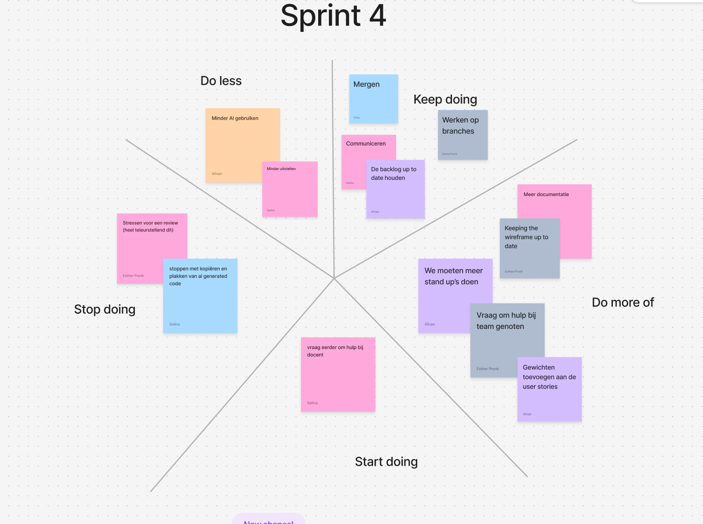

# Retrospective sprint 4

## Uitkomst retrospective



## Aandeel teamleden
In deze sprint heeft iedereen ongeveer twee tot drie user stories afgerond.

```
    title Storypoints per Teamlid   
    "Esther" : 15 
    "Afnan" : 15
    "Chibu" : 13
    "Salina" : 13
```

## Feedback voor teamleden

### Esther

#### Tops
- Goed bezig met merge conflicten handelen.
- Hartstikke behulpzaam en helpt wanneer iemand hulp nodig heeft.

#### Tips
- Blijf het wireframe steeds up-to-date te houden met onze pagina.
- Werk minder naast school, zodat je je meer kan focussen op je schoolwerk.

### Chibu

#### Tops
- Behulpzaam, helpt altijd wanneer iemand vast zit.
- Goede inzicht in de code die hij schrijft. 

#### Tips
- Probeer meer de UML bij te houden.
- Meer slaap krijgen.

### Salina

#### Tops
- Slimme oplossing gevonden voor de zetels.
- Je bent altijd aanwezig.

### Tips
- Eerder om hulp vragen wanneer je vast zit.
- Meer gestructureerde werken.

### Afnan

#### Tops
- Houdt goed je product backlog bij.
- Veel gedaan deze sprint, goed gedaan!

#### Tips
- Meer aan de commit conventies houden.
- Meer technische documentatie schrijven.


##### Eigen reflectie

// Geef een persoonlijk ontwikkeldoel aan en vertel concreet hoe je hier de komende sprint aan gaat werken (maak het SMART).


->>>>> DLO, upload per persoon op de DLO een doc.

Noem deze retrospective sprint 5 (zodat we weten waar het over gaat)
