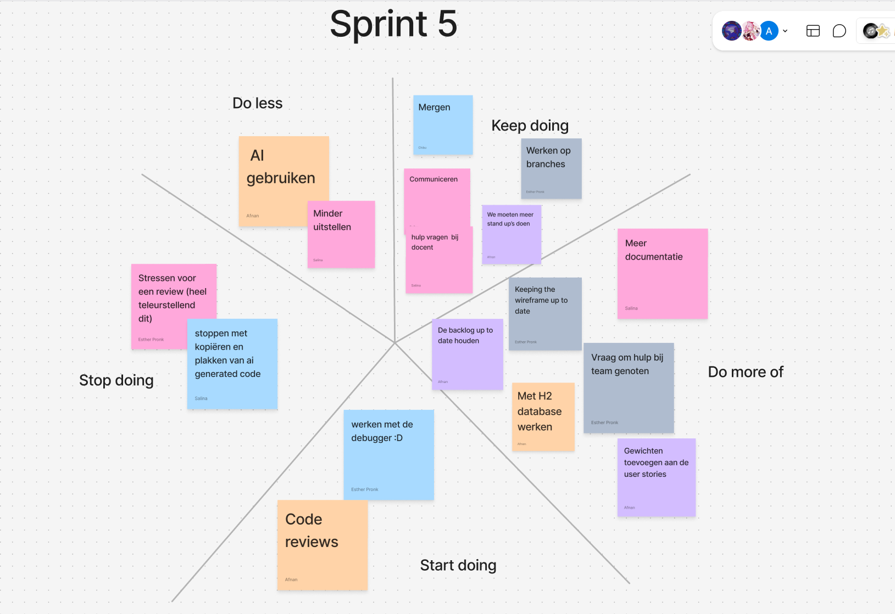

# Retrospective sprint 4

## Uitkomst retrospective



## Aandeel teamleden
In deze sprint hebben we wat minder user stories kunnen afronden. 
Dat komt vooral doordat de user stories die we hebben opgepakt best wel groot waren 
en nieuwe functies voor onze websites lieten zien.

```
    title Storypoints per Teamlid   
    "Esther" : 15 
    "Salina" : 15
    "Afnan" : 13
    "Chibu" : 10
    
```

## Feedback voor teamleden

### Esther

#### Tops
- Je bent altijd aanwezig.
- Je bent echt een topper!

#### Tips
- In kleinere functies werken, je methodes op splitsen om meer aan te houden aan de best practices.
- Documentatie beter houden.

### Chibu

#### Tops
- Mooie toepassing van de vue charts.
- Altijd op tijd aanwezig.

#### Tips
- Hou een consistente structuur aan in je code, zodat het overeenkomt met de rest van het team.
- Meer aan back-end werken voor de volgende sprint.

### Salina

#### Tops
- Je vraagt om hulp wanneer je vast zit, goed gedaan!
- Veel gewerkt.

### Tips
- Begin op tijd met mergen.
- Minder AI gebruiken.

### Afnan

#### Tops
- Heel erg behulpzaam geweest.
- Goed gewerkt met de H2 database.

#### Tips
- Minder met AI werken.
- Meer documenteren.


##### Eigen reflectie

// Geef een persoonlijk ontwikkeldoel aan en vertel concreet hoe je hier de komende sprint aan gaat werken (maak het SMART).


->>>>> DLO, upload per persoon op de DLO een doc.

Noem deze retrospective sprint 5 (zodat we weten waar het over gaat)
