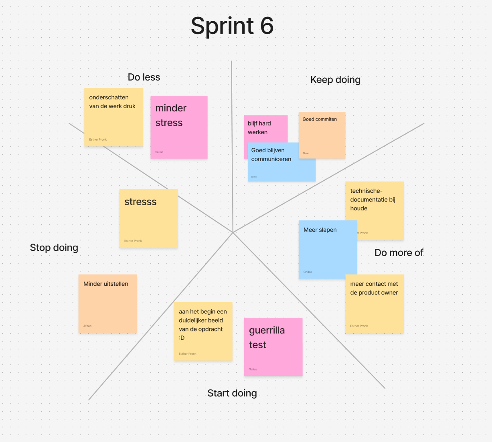

# Retrospective sprint 6

## Uitkomst retrospective

## Aandeel teamleden

title Storypoints per Teamlid  
Afnan : 17

Esther : 16

Salina : 16

Chibu : 14
    

## Feedback voor teamleden

### Esther

#### Tops
- Goeie java-doc.
- Je bent een goed teamlid.

#### Tips
- Eerdere planning voor jezelf maken
- Slaap een beetje uit.

### Chibu

#### Tops
- Goed gewerkt.
- Goed gecommuniceerd.

#### Tips
- Meer java-doc.
- Werk meer in je eigen bestanden.

### Salina

#### Tops
- Je doorzettingsvermogen is goed.
- Je hebt goed gewerkt.

### Tips
- Maak een planning.
- Niet om twaalf uur 's nachts werken.

### Afnan

#### Tops
- Goed gewerkt.
- Mooie comments.

#### Tips
- Werk aan je uitstelgedrag.
- Heb wat zelfvertrouwen.

##### Eigen reflectie

// Geef een persoonlijk ontwikkeldoel aan en vertel concreet hoe je hier de komende sprint aan gaat werken (maak het SMART).

->>>>> DLO, upload per persoon op de DLO een doc.

Noem deze retrospective sprint 5 (zodat we weten waar het over gaat)
